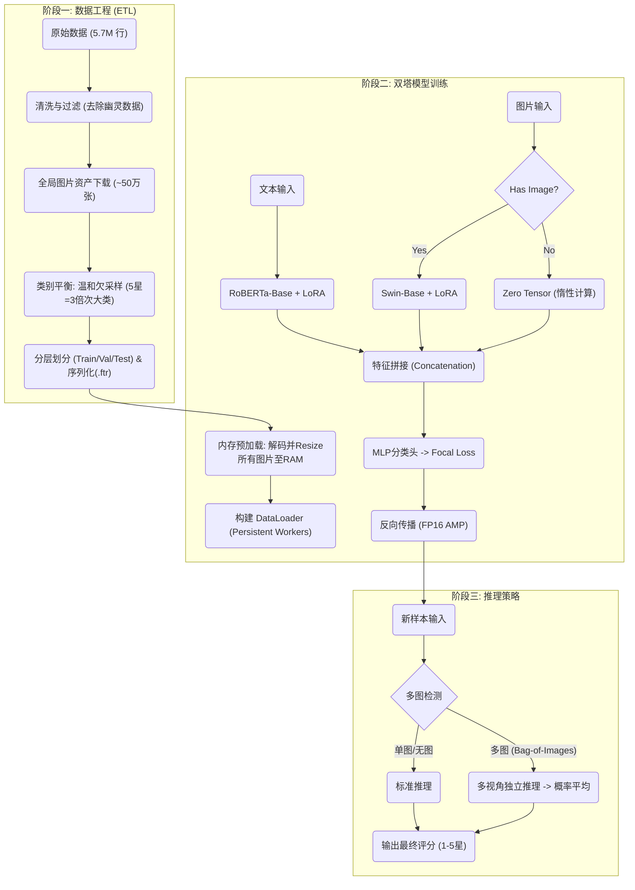
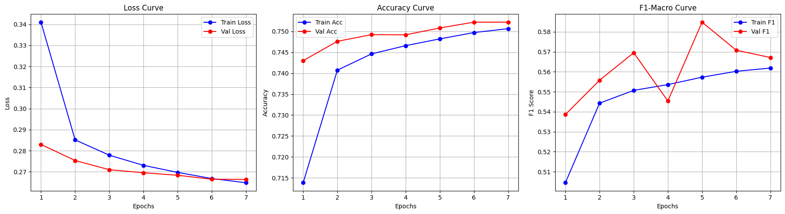
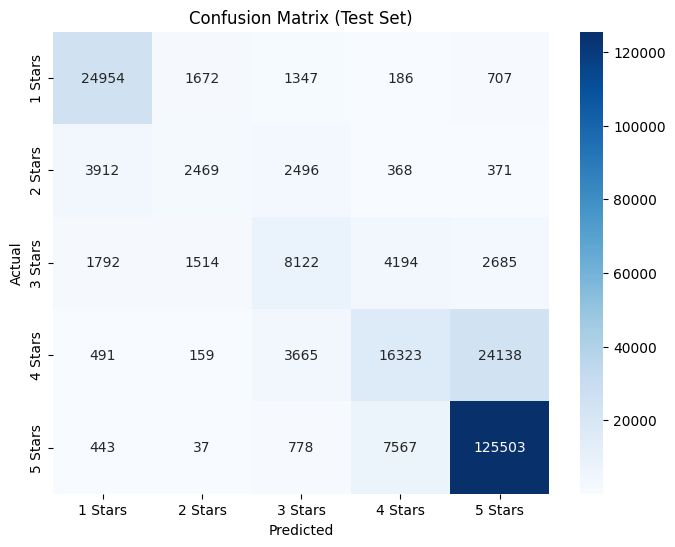
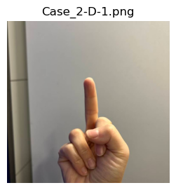
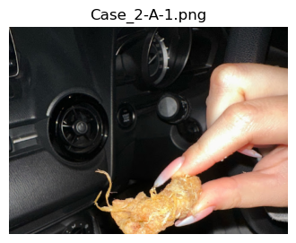
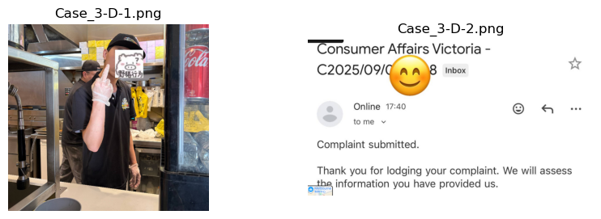
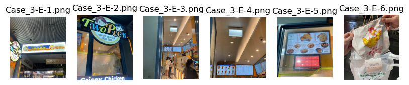

# App 1 技术文档：多模态情感分类器 (Multimodal Sentiment Classifier)

**日期:** 2026-01-05
**作者:** Zihan Yin

---

## 1. 项目概览与架构 (Overview & Architecture)

App 1 是一个基于 **双塔架构 (Two-Tower Architecture)** 的多模态分类器，旨在利用 Google Maps 的评论文本与用户上传图片共同预测 1-5 星的评分。该系统解决了真实世界评论数据中视觉模态稀疏（仅 8% 样本含图）与标签长尾分布的问题，通过条件计算和内存优化策略，在 A100 环境下实现了高效训练。

### 1.1 系统工作流
下图展示了从原始数据清洗、双塔模型训练到最终推理的全流程：

## 2. 数据工程 (Data Engineering)

数据处理管道旨在从非结构化的原始数据中提取高质量、平衡的训练集。该过程主要涉及数据清洗、资产获取与类别平衡三个关键步骤。

在**数据清洗与过滤**阶段，系统处理了约 570 万行原始数据。首先剔除标签缺失的样本，随后移除既无文本也无图片的“幽灵数据”。为了最大化数据利用率，系统特意保留了纯文本评论，这构成了训练数据的绝大多数（约 92%）。

**全局资产获取**是通过构建多线程下载器实现的。系统从 Google CDN 获取了约 50 万张图片，并将其作为独立于 App 的全局资产存储。这种解耦设计允许后续模块（如 App 5）复用图像资源，避免重复下载。

针对原始数据中严重的**长尾分布**（5星评论占据主导地位），采用了**温和欠采样 (Mild Undersampling)** 策略。系统将 5 星样本的数量严格限制为次大类别数量的 3 倍。这种策略在保留数据多样性与缓解模型偏见之间取得了平衡，配合后续的 Focal Loss 损失函数，有效解决了类别不平衡问题。最终数据集按 80:10:10 的比例进行分层划分，并保存为 Feather 格式以支持高速读取。

---

## 3. 模型架构 (Model Architecture)

App 1 的核心是一个经过参数高效微调（PEFT）的双塔多模态模型。该架构设计充分考虑了文本与视觉特征的异构性。

### 3.1 文本塔 (Text Tower)
文本特征提取依赖于 **RoBERTa-Base** 模型。输入文本经过 Tokenizer 处理，截断长度设定为 **128 Tokens**，该长度覆盖了数据集中 99% 的样本分布。为了降低显存占用，系统仅对 Query 和 Value 模块注入了 **LoRA** (Rank=16, Alpha=32, Dropout=0.1) 适配器，冻结了预训练主干参数。

### 3.2 视觉塔 (Visual Tower)
视觉特征由 **Swin-Base** (Hierarchical Vision Transformer) 提取。图片经过 Resize (224x224) 和归一化处理后输入模型。与文本塔类似，视觉塔也采用了 LoRA 微调策略。为了解决 PEFT 库传入非视觉参数（如 `input_ids`）导致的兼容性问题，系统实现了一个自定义封装类 `PatchedSwinModel`，用于过滤无关参数。

### 3.3 融合与条件计算 (Fusion & Conditional Computation)
两个塔输出的特征向量在融合层进行拼接 (Concatenation)，融合后的维度为 1792 (768 text + 1024 image)。融合特征随后通过一个包含 BatchNorm、ReLU 和 Dropout (0.3) 的 MLP 分类头映射到 5 个评分类别。

**关键工程优化：智能惰性计算 (Smart Lazy Execution)**
鉴于数据集中 92% 的样本缺失图像，模型实现了一种动态计算图机制。在前向传播 (`forward`) 过程中，系统会检查当前 Batch 的 `img_mask`。对于无图样本，模型直接跳过 Swin Transformer 的繁重计算，使用全零张量填充视觉特征槽位。这一策略显著提升了训练吞吐量，将单 Epoch 的训练时间控制在 27 分钟以内。

---

## 4. 训练基础设施与策略 (Training Infrastructure)

模型训练在 **NVIDIA A100 (40GB)** 环境下进行，采用了多项工程策略以最大化硬件利用率。

### 4.1 全内存预加载 (In-Memory Caching)
为了消除磁盘 I/O 瓶颈，训练流程引入了全内存预加载机制。在训练循环启动前，系统会扫描训练集和验证集涉及的约 9.5 万张唯一图片，将其读取、解码并 Resize 至 256x256，随后驻留在 CPU 内存中。这使得 GPU 在训练时可以零延迟地获取图像数据。

### 4.2 超参数与优化配置
* **优化器**: AdamW，采用分层学习率策略（Backbone: 1e-4, Classifier Head: 1e-3）。
* **损失函数**: **Focal Loss** (Alpha=1, Gamma=2)，旨在让模型更关注难以分类的少数类样本。
* **Batch Size**: 512，配合 FP16 混合精度训练 (AMP)，最大化显存吞吐。
* **训练周期**: 设定为 8 Epochs，配合 Patience=2 的早停机制 (Early Stopping)。

### 4.3 训练动态分析
从下方的学习曲线可以看出，模型训练过程非常健康。Train Loss 和 Val Loss 同步下降，未出现过拟合迹象。模型最终在第 7 Epoch 触发早停，最佳权重取自第 5 Epoch。

---

## 5. 性能评估与分析 (Evaluation)

模型在独立测试集上取得了 **Accuracy: 75.19%** 和 **F1-Macro: 0.5859** 的成绩。

### 5.1 混淆矩阵分析
通过下方的混淆矩阵可以观察到详细的分类行为：
* **两极分化优势**: 模型在识别极端情感（1星和5星）方面表现优异，F1 分数分别达到 0.83 和 0.87。
* **中间类别瓶颈**: 模型在区分 2星、3星和 4星时面临挑战。特别是 **4星样本**，有大量（24,138例）被误判为 5 星。这反映了模型难以精准界定“完美”与“满意但有小瑕疵”之间的语义边界。

---

## 6. 推理逻辑与案例研究 (Inference Logic & Case Studies)

推理阶段采用了 **Bag-of-Images** 策略来处理包含多张图片的评论。对于一个包含 $N$ 张图片的样本，模型会执行 $N$ 次独立推理（(文本 + 图片1), (文本 + 图片2)...），最后取概率分布的均值作为最终预测结果。

### 6.1 典型案例分析

**案例 A：视觉特征强化负面情感**
在 Case 2-D 中，文本主要抱怨服务态度傲慢 ("Arrogant attitude")。视觉模态提供了一个极具侮辱性的手势（竖中指）。模型成功捕捉到了这一强烈的视觉负面信号，与文本情感形成共振，给出了置信度高达 0.82 的 **1星** 预测。这证明了视觉塔在非标准化情感表达中的关键作用。

> I am extremely disappointed and frustrated with this place. I originally wanted to order delivery, but for the past two weeks, their delivery has been closed by around 6pm every day. Today I finally decided to dine in and ordered from their kiosk. I waited 30 minutes, and my number never showed up on the screen. I politely asked a staff member if I had missed my order, and with the most arrogant attitude, they told me: “You didn’t miss it. Go wait another hour.” Seriously?! I was speechless. I stepped outside to wait in the rain, and the more I thought about it, the angrier I got. I came back inside to ask for a refund. Right before me, another girl asked if her order was ready, and the staff straight-up asked her: “Have you waited an hour? If not, go keep waiting.” She was literally soaked from the rain, and that’s how she was treated. When it was my turn, I calmly asked for a refund because I couldn’t wait anymore. The staff coldly told me they don’t do refunds and insisted I must wait one hour. What kind of business is this?! If you make every single customer wait an hour with zero updates, horrible service, and no seating at all, why even offer dine-in orders? There’s nowhere to sit, customers are forced to wait outside in bad weather, and the attitude is appalling. This is hands down one of the worst customer service experiences I’ve ever had. I’m honestly shocked this place is even allowed to operate like this.

**案例 B：细粒度视觉缺陷识别**
在 Case 2-A 中，文本提及卫生问题。图片清晰展示了炸鸡上未处理干净的鸡毛。模型识别出了这一具体的视觉缺陷，将其与负面评分正确关联，预测为 **1星**。

> PLEASE READ ! 我们今天晚上点的炸鸡皮上有鸡毛💀 First to start off small there is No where to sit, been coming here a while and can honestly say their staff is really rude and tend to ignore customers a lot. Regardless the food is usually good. However after today me and my partner might not come back again. This honestly made me gag and throw up. The chicken skin had feathers attached on a lot of the pieces. Wanted to come on here and warn the rest of you guys. (BTW: We tested it and it wasn’t chicken, it was definitely feathers). And also they cheated us and gave us close to nothing in our servings. The bag was filled 1/3rd of the way, and two servings costed 17 dollars which basically had nothing in it. You have been warned !

**案例 C：多模态反讽识别 (Sarcasm)**
Case 3-D 展示了模型处理反讽的能力。文本使用了表面上的好评词汇 ("10/10 if that's what you're into")，但配合了投诉信截图和侮辱性手势图片。强烈的负面视觉信号成功“否决”了文本的字面含义，模型正确预测为 **1星**。

> Forget chicken, the real menu item here is the staff’s rude gestures. That’s the house specialty. Paid for chicken, got served a hand gesture instead. 10/10 if that’s what you’re into💕🇨🇳

### 6.2 失败案例与局限性 (Failure Case)

**案例 D：文本截断导致的偏差**
Case 3-E 是一个典型的错误预测。用户给出了 **4星**，评论文本很长，采用了“先扬后抑”的结构（前大段夸奖食物，末尾抱怨支付机器问题）。由于 RoBERTa 的输入被截断至 **128 Token**，模型丢失了位于文本末尾的关键负面信息（即扣分点），仅根据前半段的好评和诱人的食物图片，错误地给出了 **5星** 预测。

> The best Taiwanese fried chicken ever. Best seller here is Boneless cutlets chicken. We normally do salt pepper and mild spicy. Also plum and mild spicy is good too, but a bit sweet. A bit sad when they keep up-pricing, but can’t stop loving it. The queue is always long and have to wait for at least 10-15min. However I gotta say it’s worth the wait. The drink here is okay. Especially the herbal jelly drink is very refreshing. Plum green tea is something you’d love if you try dried salted plum before. Overall, I love 2 peck chicken. Updated: They just finished renovating. We now order through the kiosk, but it is tricky sometimes. The thing is we want to pay cash but the machine doesnt take cash, so the only option we have is card payment and that take another 50c. That is pretty annoying when the problem is not ours. It happens a lot of time and staffs cannot either solve this problem. They shouldn’t have charge us when it’s the machine’s problem.

---

## 7. 总结与改进方向 (Summary & Future Work)

App 1 成功构建了一个高效的双塔多模态分类器，证明了在视觉稀疏场景下利用图像辅助情感判断的可行性。然而，当前的实现仍存在局限性。

未来的改进方向主要包括解决 **文本截断问题**，例如将 Max Length 扩展至 256 或采用滑动窗口机制，以捕获长文本末尾的关键转折。此外，针对 **4星与5星混淆** 的问题，单纯依靠视觉特征难以区分价格、排队等非视觉维度的体验差异，未来可考虑引入序数回归 (Ordinal Regression) 或对比学习策略来增强细粒度语义的区分能力。