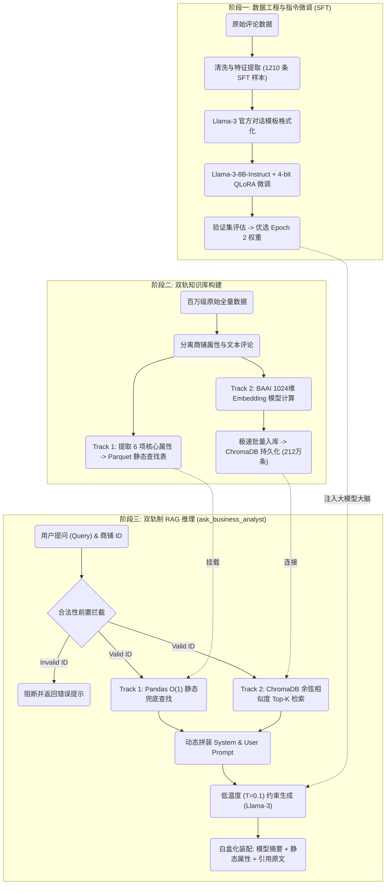
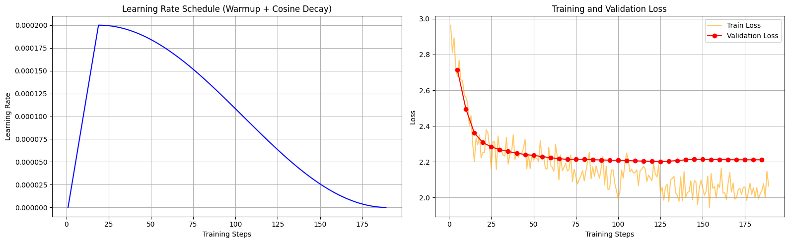

# App 5 技术文档：基于 Llama-3 的 RAG 商业分析问答系统 (RAG System for Business Analysis)

**日期:** 2026-03-02
**作者:** Zihan Yin

---

## 1. 项目概览与架构 (Overview & Architecture)

App 5 是一个基于**双轨制检索增强生成 (Dual-Track RAG)** 架构的问答系统。该系统整合了 Google Maps 的结构化商铺元数据与非结构化评论文本，通过自然语言处理技术对特定商铺的数据进行定向检索与文本摘要。

本系统的架构设计主要解决大语言模型 (LLM) 在处理外部长尾数据时的两个技术限制：
1. **静态知识局限:** 基础 LLM 的内部参数无法覆盖大规模且动态的商铺细节信息。系统通过引入向量数据库进行外部上下文的实时召回，替代模型对内部预训练知识的依赖。
2. **事实幻觉 (Hallucination):** 为抑制大模型生成捏造信息，系统结合了监督指令微调 (SFT) 与外部事实检索，严格约束模型的生成边界，使其仅基于给定的检索结果进行总结。

### 1.1 系统工作流 (System Workflow)

App 5 的端到端工程链路分为三个主要阶段：数据工程与模型微调、双轨知识库构建、以及 RAG 推理流水线。下方的流程图展示了核心组件之间的数据流转机制：

---

## 2. 数据工程与 SFT 数据集构建 (Data Engineering & SFT Dataset Construction)

本模块的核心目标是将原始的长尾评论与商铺元数据，转换为适用于大语言模型监督微调 (Supervised Fine-Tuning, SFT) 的高质量问答对 (Q&A Pairs)。为确保微调后的模型具备严格的上下文溯源能力与抗幻觉特性，数据管道实施了启发式过滤、混合抽样以及负向约束生成策略。

### 2.1 原始数据清洗与特征筛选 (Data Cleaning & Feature Extraction)

数据清洗阶段分为两个独立的数据流，以保留系统在极端情况下的兜底 (Fallback) 能力：

1. **评论数据 (Reviews) 软阈值过滤:** 系统读取了约 576 万行原始评论。为保证 SFT 样本的上下文信息量，系统移除了空文本记录，并设定了 `word_count >= 10` 的软阈值。清洗后，有效长文本评论剩余 2,125,904 行，构成了包含 29,088 家商铺的 SFT 候选池。
2. **商铺元数据 (Metadata) 独立去重:** 系统读取了约 51 万条全局商铺信息，并基于 `gmap_id` 执行去重，得到 513,124 条唯一记录。该数据集未与评论数据执行强制内连接 (Inner Join)，以此保障在查询到“无评论商铺”时，系统仍能输出基础客观属性。

### 2.2 指令微调模板设计 (Instruction Tuning Prompt Design)

为合成 SFT 数据，系统调用了商用大模型 API (DeepSeek) 执行反向指令生成（即由 AI 根据给定文本生成问题与标准答案）。为模拟真实的 RAG 检索场景并增强模型鲁棒性，系统设计了以下策略：

**1. 混合抽样策略 (Hybrid Sampling):**
在组装传入 API 的上下文时，系统对目标商铺的评论执行了“3 条最长 + 7 条随机”的混合抽样。前 3 条最长评论确保了生成的问答具备足够的信息深度，而 7 条随机评论则引入了真实向量检索中常见的噪音数据。

**2. 负向约束与格式规范 (Negative Constraints):**
系统通过严格的 System Prompt 对 API 的生成行为施加了多项约束：
* **严格溯源 (Strict Traceability) & 引用规范:** 强制要求答案的每一项声明均需直接来源于提供的评论，并在相关句末使用 `[x]` 格式标注来源序列号（如 `[1][3]`）。
* **抗幻觉负向采样 (Unanswerable Queries):** 设定 20% 的概率，要求 API 生成一个在当前评论中**完全无法找到答案**的合理问题，并强制其回答：“*I'm sorry, but the provided customer reviews do not contain information regarding this.*” 此机制是训练 Llama-3 掌握抗幻觉能力的核心。
* **样本量感知屏蔽:** 当提供的评论数量达到阈值时，禁止模型在回答中提及“基于 x 条评论”或进行样本量总结，以符合最终 RAG 系统处理海量动态数据的业务要求。

### 2.3 数据集分层划分与序列化 (Dataset Splitting & Serialization)

通过批量调用，系统共生成了 1210 条高质量的 SFT 问答对样本。数据集被整体打乱，并按 `1000 : 200 : 10` 的比例划分为训练集 (Train)、验证集 (Validation) 和测试集 (Test)，最终序列化为 JSONL 格式落盘。

**Token 长度分布分析与超参数决策:**
为确定微调阶段的关键超参数 `max_length`，系统对训练集的文本长度（包含 system, user, assistant 角色内容）进行了分布统计。按 `1 单词 ≈ 1.5 Tokens` 的比例估算：
* 中位数 (50%): 1,259 Tokens
* 95% 分位数: 2,589 Tokens
* 99% 分位数: 3,436 Tokens
* 最大值 (Max): 5,281 Tokens

统计分析显示，超过 99% 的样本估算长度低于 3,436 Tokens。基于此分布规律，系统将微调阶段的 `max_length` 超参数设定为 **4096**。该策略在确保绝大多数样本上下文完整性的同时，仅对不足 1% 的极端离群数据执行末尾截断，有效规避了 OOM (Out Of Memory) 风险并优化了显存利用率。

*相关JupyterNotebook: `01_Data_Preprocessing.ipynb`*

---

## 3. 大语言模型指令微调与验证 (LLM Instruction Fine-Tuning & Validation)

本模块旨在利用前置数据工程生成的 1210 条 SFT 样本，对开源基础模型进行领域适应性微调，并通过多维度的验证策略（定点抽样、人工校验与 LLM-as-a-Judge）确立生产环境下的最优模型权重。

### 3.1 基础模型选型与量化策略 (Base Model & 4-bit Quantization)

系统选择 Meta-Llama-3-8B-Instruct 作为基座模型。其内置的 128K 扩展分词器对数字与特殊符号（如 `[1][2]` 的密集引用格式）具备高压缩率，且原生的 Grouped-Query Attention (GQA) 机制有效降低了长文本推理时的 KV Cache 显存占用。

为适应显存限制 (A100 40GB)，训练过程采用了 4-bit 量化的低秩自适应微调技术 (QLoRA)：
* **量化配置:** 采用 `nf4` 数据类型与双重量化 (Double Quantization)，结合 `paged_adamw_32bit` 优化器，将 8B 模型的显存占用压缩至 6GB 左右。
* **分词器对齐:** 将缺失的 padding token 显式映射为 `eos_token` 并设定 `padding_side="right"`。
* **LoRA 注入:** 设定 `Rank=16` 和 `Alpha=32`，将可训练模块覆盖至所有线性映射层 (`q_proj`, `v_proj`, `up_proj` 等)，以获取最大化的领域适应空间。

### 3.2 QLoRA 超参数配置与训练动态 (QLoRA Hyperparameters & Training Dynamics)

模型基于 Llama-3 官方对话模板 (Chat Template) 格式化输入，并配置了以下核心超参数：
* **批处理与长度:** `per_device_train_batch_size=2` 配合 `gradient_accumulation_steps=8`（等效全局 Batch Size = 16）；硬性截断长度设为 `max_length=4096`。
* **学习率调度:** 峰值学习率设为 `2e-4`，实施 10% 步数的线性预热 (Warmup) 与余弦衰减 (Cosine Decay)。
* **防灾策略:** 设定严格的梯度裁剪阈值 `max_grad_norm=0.3`，抑制 4-bit 量化可能引发的梯度尖峰。

**训练指标监控与学习曲线分析:**

系统提取了 3 个 Epoch 的训练日志。分析上图可知，验证损失 (Validation Loss) 在前 100 步快速下降。在 **Step 125 (约 Epoch 2.0)** 处，验证损失达到全局最低点 (`2.202`)。进入 Epoch 3 后，训练损失持续下降，但验证损失出现微弱上翘与停滞 (`2.211+`)，表明模型开始出现过拟合 (Overfitting) 趋势。

### 3.3 模型验证与最佳 Checkpoint 优选 (Model Validation & Checkpoint Selection)

针对 Epoch 2 (checkpoint-126) 与 Epoch 3 (checkpoint-189) 的模型权重，系统执行了包含人工审查与自动化打分的综合验证。

**1. 定性分析 (格式对齐与抗噪能力):**
* **格式与语气:** 两个版本的模型均成功抹除了预训练权重中冗余的外部建议（如 "As a local business analyst..."），并对齐了严格的 `[x]` 尾注引用格式。
* **抗噪表现:** 面对 SFT 训练集中的脏标签（如商用 API 生成的假阴性回答或过度发散的实体），**Epoch 2** 模型表现出高度的鲁棒性。它严格遵循 System Prompt，精准过滤了未被询问的信息，并纠正了 Ground Truth 中的错误。
* **过拟合特征:** 在 **Epoch 3** 的推理中，模型为追求文本的极度精炼，出现了明显的语义过度压缩现象。具体表现为实体错位 (Entity Misattribution)（将理发师 A 的评价归因于理发师 B）与引用标签合并（将不同信息来源强行合并至单一标签），印证了学习曲线中的过拟合拐点。

**2. 自动化量化打分 (LLM-as-a-Judge):**
系统引入 DeepSeek-V3 作为中立评判，依据事实准确度、格式遵从度与客观性三个维度对测试集（10 条样本）进行 1-10 分的量化打分：
* **Epoch 2 (checkpoint-126):** 平均得分 **7.90/10.0**，在信息隔离与事实提取任务中表现稳定。
* **Epoch 3 (checkpoint-189):** 平均得分 7.70/10.0，因事实错位与幻觉现象受到降分惩罚。

**选型决策:**
统计学指标、人工定性审查与第三方 API 定量打分均一致指向同一结论。系统最终选定 **Epoch 2 (checkpoint-126)** 的 LoRA 权重作为本任务的最优模型版本，并输出至下一阶段的 RAG 流水线中部署。

*相关JupyterNotebook: `02_Fine_Tuning_LLM.ipynb`, `03_LLM_Validation.ipynb`*

---

## 4. 向量数据库与双轨检索架构 (Vector Database & Dual-Track Retrieval)

为限制模型在生成阶段产生事实幻觉，系统引入了双轨制检索增强生成 (Dual-Track RAG) 架构，将结构化静态属性与非结构化评论文本分离存储与检索，构建了互不干扰的外部记忆库。

### 4.1 Embedding 模型选型
系统选用 `BAAI/bge-large-en-v1.5` 作为底层 Embedding 模型。该模型将自然语言映射为 1024 维的高维稠密向量空间，能够保留更细粒度的语义特征，有效支持隐式概念与同义词的跨词汇映射。

### 4.2 向量数据库构建与大规模入库
针对 212 万条有效长评论的向量化与持久化，实施了以下关键工程策略：
* **I/O 优化:** 为规避云端硬盘高读写延迟，优先在计算节点本地磁盘构建 ChromaDB 实例，全量写入完成后再整体迁移至云盘。
* **并发控制与防灾:** 针对 ChromaDB 底层 SQLite 的单次 SQL 变量承载上限，将入库批次大小 (`BATCH_SIZE`) 严格限制为 5000；采用 `upsert` (更新或插入) 操作，确保在系统异常重启时防范数据重复写入。

### 4.3 Track 1: 静态元数据精确查找 (Parquet Lookup)
提取约 51.3 万家去重商铺的 7 项核心特征（如类别、地址、评级、URL），序列化为 Parquet 格式的静态查找表 (`gmap_metadata_lookup.parquet`)。在推理阶段，Track 1 通过合法的 `gmap_id` 执行 O(1) 复杂度的精确键值查找，为终端系统提供绝对准确的基础客观信息兜底。

### 4.4 Track 2: 动态语义检索 (ChromaDB)
212 万条文本向量被存入 ChromaDB，每条向量均强制挂载所属商铺的 `gmap_id` 作为元数据 (Metadata)。
* **检索与验证:** 在推理阶段，系统通过元数据过滤严格实现商铺级的数据隔离。联合验证表明，面对高度抽象的用户提问（如以 "entertainment facilities" 替代具体的 "arcade machines"），系统成功绕过了字面关键词匹配的局限，精准召回了对应的原始评论，验证了双轨检索机制的有效性。

*相关JupyterNotebook: `04_Vector_Database_Build.ipynb`*

---

## 5. 端到端 RAG 推理与系统评估 (End-to-End RAG Inference & System Evaluation)

本模块将前期构建的静态元数据查找表 (Parquet)、语义向量数据库 (ChromaDB) 与指令微调后的大语言模型 (Llama-3 Epoch 2) 封装为统一的推理流水线，并针对真实业务场景执行了系统级工程评估。

### 5.1 核心 RAG 流水线集成 (RAG Pipeline Integration)

系统将端到端推理过程封装为 `ask_business_analyst` 函数。该函数依据以下逻辑执行数据流转：
1. **前置拦截 (Input Validation):** 校验传入的 `gmap_id` 是否在 Parquet 索引中。若不存在，直接阻断流程，避免无效算力消耗。
2. **Track 1 (静态兜底):** 基于 Pandas 执行 O(1) 查找，提取商铺基础客观属性（地址、类别等），确保基础信息稳定输出。
3. **Track 2 (动态检索):** 使用 Embedding 模型将提问向量化，在 ChromaDB 中附带元数据过滤条件并执行 Top-K 余弦相似度检索。
4. **约束生成与白盒输出:** 将 Track 1 与 Track 2 的数据注入提示词模板。LLM 在低温度 (`T=0.1`) 设定下执行事实提取。最终输出拼接了模型摘要、静态属性与检索原文，实现推理过程的白盒化溯源。

### 5.2 Test Case 1: 基准对齐测试 (Baseline Alignment Test)

本环节通过对比 SFT 静态基准数据与 RAG 动态检索结果，验证系统从闭卷记忆向开卷检索的过渡能力。测试涵盖了 Great Clips、Vape Prodigy 等样本。
* **动态特征召回:** ChromaDB 展现了跨记录的语义召回能力。与微调阶段固定的 10 条上下文不同，检索模块能够依据具体提问，实时提取出 SFT 训练集中未曾出现的评论记录进入 Top-10 范围。
* **数据纠错与引用修正:** 测试暴露出 SFT 原始标签中存在假阴性（如 Boss Food & Liquor 样本中错误标注“无相关信息”）。RAG 系统未受微调记忆干扰，成功基于动态召回的上下文提取了准确事实，并能根据实时传入的文本顺序，动态且准确地更新 `[x]` 引用标号。

### 5.3 Test Case 2: 幻觉与边界容错测试 (Anti-Hallucination & Boundary Test)

本环节针对三种极端的边界条件输入，验证系统的异常处理与抗幻觉机制：
1. **跨领域无关提问 (场景 A):** 针对理发店提出餐饮类问题。模型严格遵循系统提示词，输出上下文无相关信息的声明，未调用内部预训练权重产生捏造事实 (Hallucination)。
2. **零评论商铺兜底 (场景 B):** 针对存在于查找表但在向量库中无评论的商铺。代码逻辑成功传递空上下文，模型如实作答数据不足，同时 Track 1 的静态兜底信息正常渲染。
3. **非法 ID 拦截 (场景 C):** 输入虚假标识符。系统在前置校验阶段成功触发阻断，未启动后续的向量检索与模型推理，验证了资源的有效保护机制。

### 5.4 Test Case 3: 开放域交互与泛化测试 (Open-domain Interactive Test)

本环节采用“盲盒随机抽样 + 人工非标提问”的模式，评估系统处理真实 C 端复杂输入的泛化能力。
* **输入鲁棒性:** 在面对刻意保留的语法错误与口语化缩写（如 "Do this Irish pub has", "help u"）时，模型未受干扰，准确解析了用户的核心意图。
* **隐式概念映射:** 面对宏观的提问（如查询 "job domains"），模型成功将检索到的具体岗位实例（"DBA"）向上归纳为泛化概念（"IT and technology fields"），完成了有效的信息抽象。
* **工程瑕疵记录 (Artifact Observation):** 在 Pizza Hut 样本的测试中，系统暴露了 LLM 常见的归因偏差问题。模型在处理长文本逻辑反转时，将无关服务质量的评论 `[6]` 错误归因为关于“肉量”的评价。此记录客观表明，当前 8B 级别的模型在高度复杂的长文本多源聚合中，仍存在偶发的注意力偏移现象。

*相关JupyterNotebook: `05_Model_Query.ipynb`*

---

## 6. 总结与改进方向 (Summary & Future Work)

### 6.1 工程架构总结

App 5 成功构建并部署了一个基于 Llama-3 的双轨制检索增强生成 (Dual-Track RAG) 系统。通过将业务逻辑解耦为静态查找表 (Track 1) 与动态语义向量库 (Track 2)，系统在处理包含 212 万条长尾评论的数据集时，实现了稳定的端到端推理。

在算法与数据工程层面，系统验证了以下技术路径的有效性：
1. **抗幻觉微调 (Anti-Hallucination SFT):** 通过在指令微调阶段引入 20% 的“拒绝回答”负样本约束，显著增强了生成模型对外部检索上下文的忠实度，有效抑制了基于底层预训练权重的内部参数幻觉。
2. **容错与抗噪能力:** RAG 流水线在面对 SFT 阶段的脏标签（假阴性）、前置输入的非法请求、以及用户口语化的非标准查询时，均能通过既定的兜底逻辑或模型的泛化能力输出客观事实，系统具备较高的工程鲁棒性。

### 6.2 局限性与改进方向

尽管系统在基准测试中达到了预期指标，但根据开放域交互测试 (Test Case 3) 的执行记录，当前架构仍存在以下工程局限，这也是未来优化的核心方向：

1. **引入重排机制 (Re-ranking Integration):**
   当前 Track 2 的检索仅依赖 BGE 模型的向量余弦相似度（双编码器架构）。未来可引入 Cross-Encoder 重排模型（如 BGE-Reranker），对召回的初筛 Top-K 结果进行更深度的语义匹配计算，以进一步提升高相关性上下文的排序精度。

2. **长文本注意力衰减优化 (Context Attention Decay):**
   测试表明，在处理包含多重逻辑反转的长文本时，当前的 8B 参数模型偶尔会出现引用归因偏差（实体张冠李戴）。后续可通过扩展 Context Window 训练、应用 RoPE (Rotary Position Embedding) 缩放技术，或升级至更大参数量级的基座模型（如 70B 级别）来改善模型对长上下文的注意力保持能力。

3. **多模态特征融合 (Multimodal RAG):**
   当前 RAG 系统仅基于纯文本模态运行。考虑到 App 1 已成功构建了针对商铺图像的视觉提取塔 (Visual Tower)，未来演进可尝试构建多模态 RAG (Vision-Language RAG) 架构。通过将图像 Embedding 存入向量数据库，使系统能够回答诸如“这家店的菜单排版如何”或“环境卫生状况”等高度依赖视觉特征的提问。